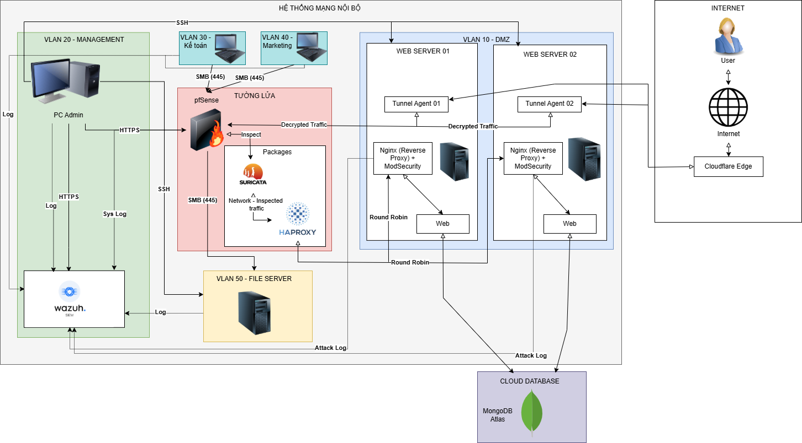

# 🛡️ Blue Team Defense Simulation - Enterprise Network Security
> **Đồ án môn học: An toàn mạng (NT140)** | **Khoa Mạng Máy tính & Truyền thông - UIT**

## 📖 Giới thiệu (Overview)
Dự án này tập trung thiết kế và triển khai hệ thống bảo mật toàn diện cho một **Mạng doanh nghiệp quy mô nhỏ** với đầy đủ các thành phần hạ tầng thực tế.

Hệ thống được xây dựng dựa trên kiến trúc phân vùng mạng (Network Segmentation) chặt chẽ, bao gồm nhiều vùng chức năng như DMZ, File Server, mạng các Phòng ban và vùng Quản trị (Management). Mục tiêu là áp dụng chiến lược **Defense in Depth (Phòng thủ chiều sâu)** để bảo vệ tài nguyên doanh nghiệp trước các kịch bản tấn công đa dạng.

🔗 **[Tải báo cáo chi tiết (PDF)](NT140_BlueTeam.pdf)**

---

## 🏗️ Sơ đồ & Kiến trúc Mạng (Network Topology)

Hệ thống mô phỏng một hạ tầng mạng doanh nghiệp hoàn chỉnh, được phân tách thành các vùng an toàn (Zones) thông qua Firewall:

### Các phân vùng mạng (Network Zones):
1.  **Edge / WAN:**
    * Sử dụng **Cloudflare** làm lớp bảo vệ đầu tiên (CDN, DNS Proxy) để ẩn IP thực và lọc traffic rác từ Internet.
2.  **Gateway Zone (pfSense Firewall):**
    * Đóng vai trò là cổng kết nối chính, kiểm soát toàn bộ lưu lượng ra/vào.
    * Tích hợp **Suricata (IDS/IPS)** để giám sát và ngăn chặn xâm nhập ngay tại biên mạng.
3.  **DMZ Zone (Demilitarized Zone):**
    * Nơi đặt các dịch vụ công khai.
    * **02 Web Servers:** Chạy ứng dụng web phục vụ người dùng, được cân bằng tải nhờ HAProxy và bảo vệ bởi ModSecurity.
4.  **Internal / LAN Zone (Vùng nội bộ):**
    * **File Server:** Lưu trữ dữ liệu quan trọng, tài liệu nội bộ của doanh nghiệp.
    * **Departments (Các phòng ban):** Mạng dành cho nhân viên các phòng ban kết nối và làm việc.
    * *Chính sách:* Kiểm soát chặt chẽ quyền truy cập vào File Server; vùng này không được truy cập trực tiếp từ Internet.
5.  **Management Zone:**
    * **Wazuh Server (SIEM):** Trung tâm giám sát log, phân tích sự kiện bảo mật và điều phối phản ứng.
    * Vùng này được cách ly hoàn toàn để đảm bảo tính toàn vẹn của dữ liệu nhật ký.

---

## 🛠️ Giải pháp Kỹ thuật đã triển khai

Hệ thống áp dụng bảo mật đa lớp từ lớp mạng đến lớp ứng dụng và giám sát trung tâm:

### 1. Edge Security (Cloudflare)
Đây là lớp phòng thủ đầu tiên (Lớp biên) giúp ẩn danh hạ tầng và lọc traffic rác trước khi đi vào hệ thống mạng doanh nghiệp.
* **DNS Proxy (Ẩn IP):** Che giấu địa chỉ IP thực của hệ thống, ngăn chặn kẻ tấn công thực hiện dò quét trực tiếp vào hạ tầng mạng vật lý.
* **WAF Rules & Page Rules:**
    * Thiết lập quy tắc chặn truy cập vào các đường dẫn nhạy cảm hoặc không cần thiết (như `.env`, `.git`, `.ssh`) ngay tại biên.
    * Chặn các request có đuôi file thực thi (`.php`) từ các nguồn đáng ngờ để giảm tải cho Server backend.
* **DDoS Protection (Rate Limiting):** Cấu hình giới hạn số lượng request cho phép từ một địa chỉ IP trong một khoảng thời gian nhất định. Nếu vượt quá ngưỡng này, Cloudflare sẽ tự động chặn để ngăn chặn tấn công HTTP Flood và Brute-force.

### 2. Network Security (pfSense & Suricata)
* **VLAN Segmentation:** Thiết lập các VLAN riêng biệt cho Web Server, File Server, và các Phòng ban để cô lập rủi ro.
* **Firewall Rules:**
    * Áp dụng chính sách **Default Deny**.
    * Thiết lập luật cho phép truy cập có điều kiện (ví dụ: Chỉ cho phép một số phòng ban cụ thể truy cập File Server qua giao thức SMB).
* **Intrusion Prevention System (Suricata):** Cấu hình Suricata chạy trên pfSense (Inline mode) để phát hiện các dấu hiệu tấn công mạng và tự động drop gói tin độc hại.

### 3. Application Security (Nginx & ModSecurity)
* **Web Server Hardening:** Cấu hình Nginx trên cụm Web Server để tối ưu hiệu năng và bảo mật.
* **WAF (ModSecurity):**
    * Cài đặt ModSecurity chặn các tấn công phổ biến vào lớp ứng dụng.
    * Ngăn chặn các hành vi khai thác lỗ hổng Web (như SQL Injection, XSS) trước khi request đến được mã nguồn xử lý.

### 4. Monitoring & Response (Wazuh SIEM)
* **Centralized Logging:** Thu thập log tập trung từ tất cả các nguồn: Syslog (pfSense và Suricata), Web Access Log (Nginx), System Log (Linux/Windows) về Management Zone.
* **File Integrity Monitoring (FIM):**
    * Giám sát sự thay đổi file trên File Server theo thời gian thực.
    * Cảnh báo tức thời khi có file lạ xuất hiện hoặc file dữ liệu quan trọng bị sửa đổi/xóa trái phép.
* **Active Response:** Tự động thực thi các hành động chặn IP khi phát hiện hành vi tấn công brute-force hoặc scan mạng.

---

## ⚔️ Kết quả Kiểm thử & Mô phỏng (Simulation Results)

Dựa trên quá trình thực chiến, Đội Xanh đã ghi nhận và xử lý các kịch bản tấn công từ Đội Đỏ với một số kết quả như sau:

| Đối tượng tấn công | Kịch bản mô phỏng | Cơ chế phòng thủ kích hoạt | Kết quả |
| :--- | :--- | :--- | :--- |
| **Web Server** | **Tấn công DoS/DDoS** (HTTP Flood vào `/api/order`) | **Cloudflare & Nginx** kích hoạt Rate Limiting, tự động chặn IP khi vượt ngưỡng request cho phép. | ✅ **Đã chặn** |
| **Web Server** | **Tấn công Web** (XSS, SQL Injection) | **ModSecurity (WAF)** phát hiện payload tấn công (ví dụ: `<script>`, `' OR 1=1`) và trả về lỗi 403 Forbidden. | ✅ **Đã chặn** |
| **Web Server** | **Rà quét đường dẫn** (Gobuster: `.env`, `.git`) | **ModSecurity** và **Custom Rules** chặn truy cập vào các đường dẫn nhạy cảm hoặc không tồn tại. | ✅ **Đã chặn (403/404)** |

---

## 👥 Thành viên thực hiện
**Nhóm 12 - NT140.Q12.ANTT**
* **Trần Thị Phương Linh (23520851)**
* **Nguyễn Đức Hùng (23520565)**

**Giảng viên hướng dẫn:** PGS. TS. Lê Kim Hùng

---
*Dự án này là sản phẩm của đồ án môn học, phục vụ mục đích nghiên cứu và học tập.*
